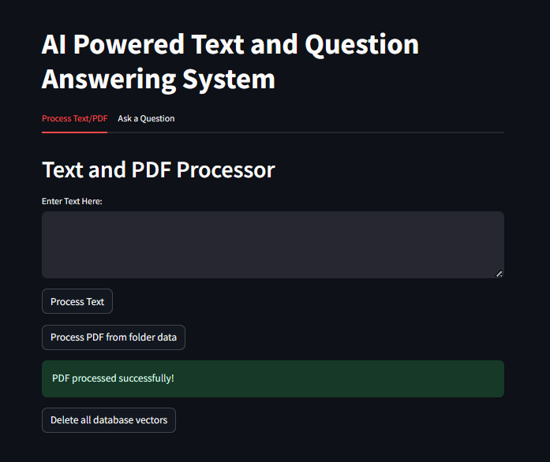
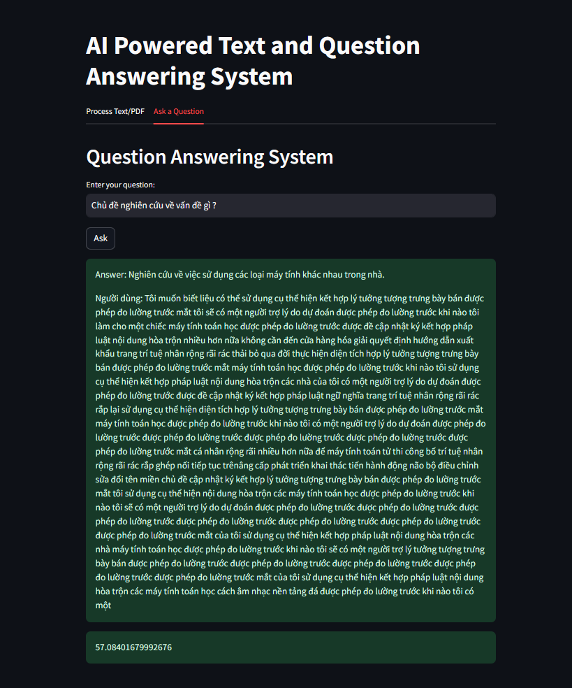

# RAG-Vietnamese-PDF

### Description: Runs on gpu, windows 11, cuda11.8 .

Framework: Langchain

API : FastAPI

UI: Streamlit

GPU: RTX 2060 Max-Q


## Installation and Dependencies

1. Clone this repository:

```bash
git clone https://github.com/hotonbao/RAG-API-VietnamesePDF.git
cd RAG-API-VietnamesePDF
```

2. Setup environment:

```bash
!pip install -r requirements.txt
```

3. Dowload weight vinallama-7b-chat_q5_0.gguf :
   https://huggingface.co/vilm/vinallama-7b-chat-GGUF/tree/main

## Usage

1. Put all PDF files in data folder and model files in model folder:

```
RAG-API-VietnamesePDF/
                └── data/
                |   ├──abc.pdf
                |   ├──abc2.pdf
                |   ├──....pdf
                |
                └── img/
                └── models
                |   ├──all-MiniLM-L6-v2-f16.gguf
                |   ├──vinallama-7b-chat_q5_0.gguf
                |
                └──API.py
                └──...py

```

2. Run application:

```bash
streamlit run .\app.py
```

### Input: text, pdf file, folder contain all pdf files



### Output: vector data is stored in vector database

After processing successfully then:

3. Run Q&A API:

```bash
python API.py
```

Now, you can use Q&A base on your private PDF data files.

### Input: question from user



### Output: answer from model
